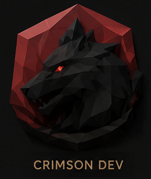
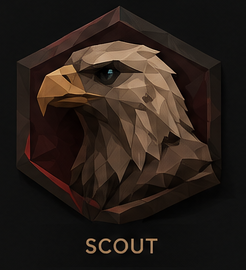
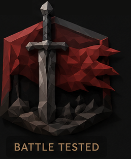
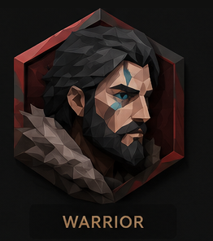
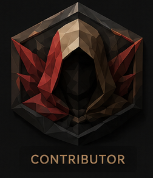
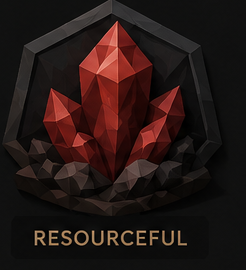
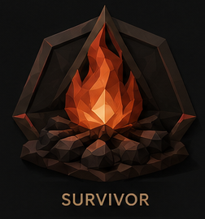
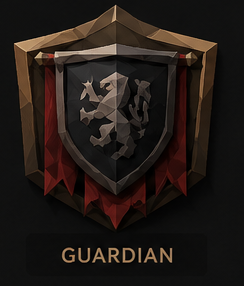
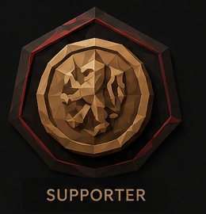

<div align="center">

# Crimson Desert Report Hub

**An unofficial, privacy-first confirmation board and source radar for Crimson Desert issues.**

<table>
  <tr>
    <td align="center"><a href="https://crimsonreporthub.com" title="Open the live site"><br><sub><b>Live site</b></sub></a></td>
    <td align="center"><a href="docs/README.md" title="Project documentation"><br><sub><b>Docs</b></sub></a></td>
    <td align="center"><a href="docs/wiki/Home.md" title="Wiki source pages"><br><sub><b>Wiki</b></sub></a></td>
    <td align="center"><a href="PRODUCT.md" title="Product notes and principles"><br><sub><b>Product</b></sub></a></td>
    <td align="center"><a href="DESIGN.md" title="Design system notes"><br><sub><b>Design</b></sub></a></td>
  </tr>
  <tr>
    <td align="center"><a href="https://github.com/Statusnone420/Crimson-Desert-Report-Hub/actions/workflows/ci.yml" title="CI runs"><br><sub><b>CI</b></sub></a></td>
    <td align="center"><a href="https://github.com/Statusnone420/Crimson-Desert-Report-Hub/issues" title="Bugs and scoped work"><br><sub><b>Issues</b></sub></a></td>
    <td align="center"><a href="https://github.com/Statusnone420/Crimson-Desert-Report-Hub/pulls" title="Open pull requests"><br><sub><b>Pull requests</b></sub></a></td>
    <td align="center"><a href="CONTRIBUTING.md" title="How to contribute"><br><sub><b>Contributing</b></sub></a></td>
    <td align="center"><a href="docs/OPERATIONS.md" title="Operations runbook"><br><sub><b>Operations</b></sub></a></td>
  </tr>
  <tr>
    <td align="center"><a href="SECURITY.md" title="Security policy"><br><sub><b>Security</b></sub></a></td>
    <td align="center"><a href="docs/PRIVACY.md" title="Privacy model"><br><sub><b>Privacy</b></sub></a></td>
    <td align="center"><a href="LICENSE" title="MIT license"><br><sub><b>MIT license</b></sub></a></td>
    <td align="center"><a href="https://github.com/Statusnone420/Crimson-Desert-Report-Hub/discussions" title="Community questions"><br><sub><b>Discussions</b></sub></a></td>
    <td align="center"><a href="https://github.com/Statusnone420/Crimson-Desert-Report-Hub/stargazers" title="Star the repo"><br><sub><b>Star the repo</b></sub></a></td>
  </tr>
</table>

<a href="https://crimsonreporthub.com">
  
</a>

<br>

<strong>Click the preview to open the live site.</strong>

</div>

## What This Is

Crimson Desert Report Hub keeps the current patch situation readable without pretending to know more than its inputs support. Structured anonymous reports are evidence, one-tap anonymous confirmations are player signals, and scanner-discovered public links are leads that generate questions—not proof.

The dashboard, issue board, and source radar are designed to remain complete and useful with zero visitors. Official patch context, scanner health, mapped lead questions, and exact-patch fix-claim provenance carry the site at N=0; community input adds resolution when it exists.

It is not affiliated with Pearl Abyss, Reddit, X, Vercel, Supabase, Tavily, or OpenRouter.

## Core Flow

```text
official patch context + scanner leads
                    -> issue questions
structured reports -> evidence counts
confirmation taps  -> player-signal counts
                    -> one count-backed readout, never a verdict
```

## Principles

- Evidence before outrage.
- Reports are evidence; confirmations are signals; scanner links are leads.
- Anonymous report and confirmation intake by default.
- No verdicts from quiet, elapsed time, or scanner links.
- No accounts, ads, analytics trackers, or public raw complaint feed.
- No raw IP storage; network hashes stay server-side for deduplication and abuse limits.
- Reddit API is permanently off. Tavily may discover public Reddit pages through normal web search and may perform bounded basic extraction against `old.reddit.com` for thin, promising results.
- Tavily is capped at 1,000 monthly credits. High-value scanner extraction and official fix-claim mapping use only `deepseek/deepseek-v4-flash` under a hard $2 UTC-month software cap and per-request price ceilings.
- Routine report moderation and dossier prose use `openrouter/free`, an explicit `:free` model, or deterministic fallback.
- Official patch notes are treated as source metadata, not branding.

## Start Here

| Need | Link |
| --- | --- |
| Live app | [crimsonreporthub.com](https://crimsonreporthub.com) |
| Project docs | [docs/README.md](docs/README.md) |
| GitHub Wiki | [Wiki](https://github.com/Statusnone420/Crimson-Desert-Report-Hub/wiki) |
| Wiki-ready source pages | [docs/wiki/Home.md](docs/wiki/Home.md) |
| Community questions | [Discussions](https://github.com/Statusnone420/Crimson-Desert-Report-Hub/discussions) |
| Discussion guide | [docs/DISCUSSIONS.md](docs/DISCUSSIONS.md) |
| Bugs and scoped work | [Issues](https://github.com/Statusnone420/Crimson-Desert-Report-Hub/issues) |
| Privacy model | [docs/PRIVACY.md](docs/PRIVACY.md) |
| Production setup | [docs/LAUNCH_CHECKLIST.md](docs/LAUNCH_CHECKLIST.md) |
| Operations | [docs/OPERATIONS.md](docs/OPERATIONS.md) |
| Security | [SECURITY.md](SECURITY.md) |

## Local Development

```bash
npm install
npm test
npm run build
npm run dev
```

Create `.env.local` from [.env.local.example](.env.local.example) for full local runs. The example caps high-value OpenRouter automation at `$2` per UTC month and Tavily at 1,000 monthly credits. Before enabling automation, configure a dedicated OpenRouter key with a provider-side monthly reset limit of `$2` or lower and verify that dashboard setting manually; the repository cannot verify it for you. Never commit `.env.local`, API keys, passwords, dashboard screenshots with secrets, or local credential notes.

## Verification

```bash
npm run lint
npm test
npm exec tsc -- --noEmit
npm run build
npm run test:e2e
```

## License

MIT. See [LICENSE](LICENSE).
