

# Crimson Desert Report Hub

**Crimson Desert news, original reports, official updates, and the player record — with sources kept in view.**

[Read the newspaper](https://crimsonreporthub.com/) · [Read the patch record](https://crimsonreporthub.com/patches) · [Check an issue](https://crimsonreporthub.com/issues) · [File an anonymous report](https://crimsonreporthub.com/report)

  <a href="https://crimsonreporthub.com" title="Open the live site">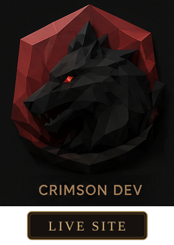</a>&nbsp;
  <a href="https://crimsonreporthub.com/issues" title="Open the public Issue Board">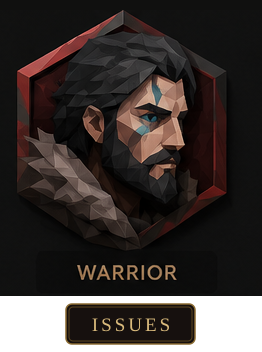</a>&nbsp;
  <a href="CONTRIBUTING.md" title="Contribute to the project">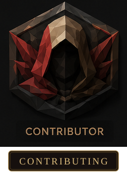</a>&nbsp;
  <a href="docs/wiki/Home.md" title="Read the wiki">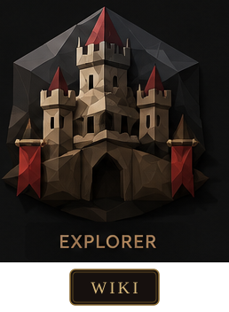</a>&nbsp;
  <a href="SECURITY.md" title="Security policy">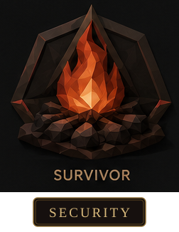</a>&nbsp;
  <a href="https://github.com/Statusnone420/Crimson-Desert-Report-Hub/stargazers" title="Star the repository">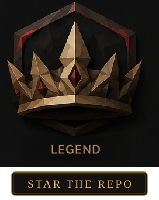</a>
   
  <a href="docs/README.md" title="Browse project documentation">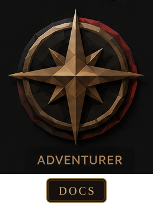</a>&nbsp;
  <a href="https://github.com/Statusnone420/Crimson-Desert-Report-Hub/actions/workflows/ci.yml" title="Continuous integration">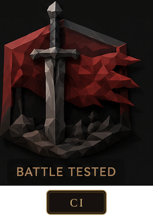</a>&nbsp;
  <a href="https://github.com/Statusnone420/Crimson-Desert-Report-Hub/pulls" title="Pull requests">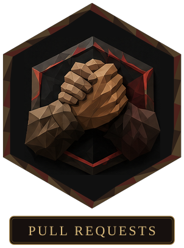</a>&nbsp;
  <a href="docs/PRIVACY.md" title="Privacy model">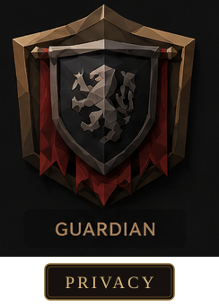</a>&nbsp;
  <a href="https://github.com/Statusnone420/Crimson-Desert-Report-Hub/discussions" title="Community discussions">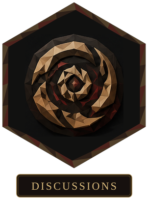</a>&nbsp;
  <a href="LICENSE" title="Apache License 2.0">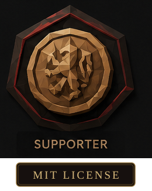</a>

Live site preview · unofficial and fan-run

## News and the player record

Crimson Desert Report Hub is an unofficial fan newspaper. Original stories and selected coverage sit alongside the official patch record and player reports.

- Read [news](https://crimsonreporthub.com/news) and watch [selected videos](https://crimsonreporthub.com/watch), with sources and publication dates.
- Follow official fixes on the [patch desk](https://crimsonreporthub.com/patches) and compare player responses on the issue board.
- File a detailed report or add a **Happening to me**, **Fixed for me**, or **Still happening** check-in.
- Explore review trends, audience activity, and source radar in [the Observatory](https://crimsonreporthub.com/observatory).

Follow original Hub articles through [Atom](https://crimsonreporthub.com/feed.xml) or [RSS](https://crimsonreporthub.com/rss.xml). External coverage and player submissions stay out of the feeds.

## Built for honest answers

Player reports are moderated evidence. Check-ins are signals. Radar links and platform trends are context. Editorial selections require review. The Hub never turns silence into “fixed” or invents activity to fill an empty board.

There are no user accounts, ads, or analytics trackers. Raw submissions, rejected scanner candidates, and uncorroborated source URLs stay private. Read the short version in [Privacy](docs/PRIVACY.md) and the full source rules in [Data Sources and Automation](docs/wiki/Data-Sources-and-Automation.md).

## Help shape the Hub

Bug reports, accessibility fixes, scanner fixtures, design improvements, and clear documentation are welcome.

  <a href="PRODUCT.md" title="Product vision">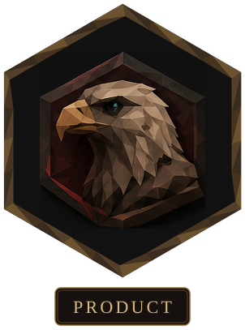</a>&nbsp;
  <a href="DESIGN.md" title="Design language">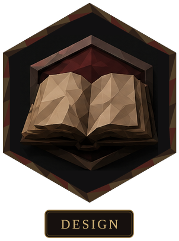</a>&nbsp;
  <a href="docs/OPERATIONS.md" title="Operations guide">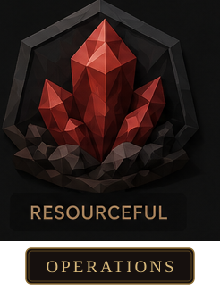</a>

- [Open a GitHub issue](https://github.com/Statusnone420/Crimson-Desert-Report-Hub/issues) when something is wrong or confusing.
- Read [Contributing](CONTRIBUTING.md) before sending code.
- Use the [documentation index](docs/README.md) or [wiki](docs/wiki/Home.md) for local setup, architecture, providers, migrations, and maintainer operations.

## Unofficial, by design

Crimson Desert Report Hub is an independent fan project and is not affiliated with Pearl Abyss. Third-party product names and marks belong to their respective owners. The code is available under the [Apache License 2.0](LICENSE).
